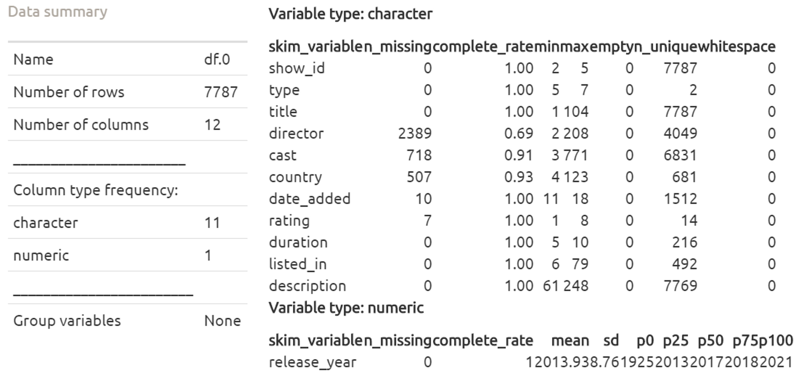
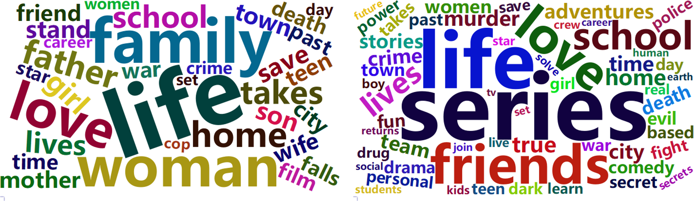

```{r setup, include = F}
knitr::opts_chunk$set(echo = TRUE, 
                      message = FALSE, 
                      warning = FALSE, 
                      fig.align = "center")
```

# 1 Objective

Netflix is a subscription-based streaming service company that offers online streaming of a library of films and television series. It is a popular entertainment service used by people around the world. This exploring data analysis will explore the Netflix dataset through visualization and graphs. This dataset consists of movies and TV shows available on Netflix as of 2021. The dataset is collected from Flixalbe which is a third-party Netflix search engine.

# 2 Preparation

Let us set up the environment and load in the dataset.

## Environment

```{r}
if(!require("pacman")) install.packages("pacman")
pacman::p_load(readr, ggplot2, skimr, dplyr, lubridate, janitor,
               ggsci, DT, forcats, stringr, tidyr, readr, gghalves,
               gridExtra, tidytext, wordcloud2, htmlwidgets, webshot,
               RColorBrewer, kableExtra, treemapify, ggpubr)

theme = theme_bw() +
  theme(plot.title = element_text(face = "bold", size = 15),
        plot.subtitle = element_text(size = 10),
        axis.title = element_text(size = 10), 
        legend.position = "none")
```

## Dataset

```{r}
df.0 = read_csv("DATA.csv")

# skim_without_charts(df.0)


```

## Clean & Manipulation

```{r}
df.1 = df.0

df.1 = df.1 %>%
  mutate(date_added = mdy(date_added)) %>% 
  clean_names()
```

# 3 Exploring Data Analysis

## 1) Are movies on netflix more than TV shows?

```{r, fig.width = 8, fig.height = 5}
temp.1 = df.1 %>% 
  group_by(type) %>% 
  summarise(count = n()) %>% 
  mutate(per = round(count/sum(count)*100, 0))

ggplot(data = temp.1,
       aes(x = "",
           y = count,
           fill = type)) +
  geom_col(position = "fill") +
  coord_polar("y",
              start = 0) +  
  geom_text(aes(label = paste0(per, "%")),
            position = position_fill(vjust = 0.5),
            size = 4) +
  scale_fill_locuszoom() +  
  theme +
  theme(axis.text.x = element_blank(),
        panel.grid = element_blank(),
        axis.ticks = element_blank(),
        legend.position = "right") +
  labs(title = "Proportion of Movie and TV Show on Netflix",
       caption = "Figure.1",
       x = NULL,
       y = NULL,
       fill = "Type")
```

It is clear that there are more movies on Netflix than TV shows.

## 2) What is the majority rating of movies and TV shows?

```{r, fig.width = 8, fig.height = 5}
temp.2 = df.1 %>% 
  filter(!is.na(rating)) %>% 
  mutate(rating = fct_lump(rating, 4)) %>%
  group_by(type, rating) %>% 
  summarise(count = n()) %>% 
  mutate(per = round(count/sum(count)*100, 0)) %>% 
  ungroup() %>% 
  arrange(type, desc(count))

test = df.1 %>%
  filter(!is.na(rating)) %>% 
  group_by(type, rating) %>% 
  summarise(count = n()) %>% 
  mutate(per = round(count/sum(count)*100, 0)) %>% 
  ungroup() %>% 
  group_by(type) %>% 
  top_n(10, count) %>% 
  ungroup() %>% 
  mutate(rating = reorder_within(rating, -count, type))

ggplot(data = test,
       aes(x = rating,
           y = count,
           fill = type)) +
  geom_col(position = "dodge",
           width = 0.7) +
  scale_x_reordered() +  
  facet_wrap(~type, scales = "free") + 
  geom_text(aes(label = paste0(per, "%")),
            vjust = -0.5) +
  scale_y_continuous(limits = c(0, 2000),
                     breaks = seq(0, 2000, 500)) +
  scale_fill_locuszoom() +
  theme +
  theme(strip.background = element_rect(fill = "white"),
        strip.text = element_text(size = 12),
        axis.text.x = element_text(angle = 90, 
                                   vjust = 0.3,
                                   hjust = 1)) + 
  labs(title = "Count by Type by Rating",
       caption = "Figure.2",
       x = "Rating",
       y = "Count")
```

The ratings above are explained above. The majority rating of movies and TV shows is TV-MA and TV-14. We can know that most of the content is provided for adult users on Netflix. Relatively, TV shows have more content to be suitable for children.

```{r}
a = c("TV-Y",
      "TV-Y7",
      "TV-Y7-FV",
      "TV-G",
      "TV-PG",
      "TV-14",
      "TV-MA",
      "PG",
      "PG-13",
      "R",
      "NR")
b = c("Ages 2 to 6", 
      "Age 7 and up",
      "Age 7 and up but contains fantasy violence",
      "All ages", 
      "All ages but parental guidance is recommended", 
      "Age 14 and up",
      "Age 17 and up",
      "All ages but parental guidance is recommended",
      "Age 13 and up",
      "Age 17 and up",
      "Not yet rated")

data.frame(a, b) %>% 
  rename("Rating Symbol" = "a",
         "Meaning" = "b") %>% 
  kbl(align = "l",
      caption = "Rating System") %>% 
  kable_classic("hover")
```

The above table is the reference for the rating system.

## 3) What are the top 10 countries for items distribution on Netflix?

```{r, fig.width = 8, fig.height = 5}
temp.3 = df.1 %>%
  select(type,
         country) %>% 
  separate_rows(country,
                sep = ",") %>% 
  mutate(country = trimws(country)) %>% 
  drop_na() %>% 
  group_by(type, country) %>% 
  summarise(count = n()) %>% 
  mutate(per = round(count/sum(count)*100, 0)) %>% 
  ungroup() %>% 
  group_by(type) %>% 
  top_n(10, count) %>% 
  ungroup() %>% 
  mutate(country = reorder_within(country, -count, type))

ggplot(data = temp.3,
       aes(x = country,
           y = count,
           fill = type)) +
  geom_col(position = "dodge",
           width = 0.7) +
  geom_text(aes(label = paste0(per, "%")),
            vjust = -0.5) +
  scale_x_reordered() +  
  facet_wrap(~type, scales = "free") + 
  scale_fill_locuszoom() +
  scale_y_continuous(limits = c(0, 3000),
                     breaks = seq(0, 3000, 500)) +
  theme +
  theme(strip.background = element_rect(fill = "white"),
        strip.text = element_text(size = 12),
        axis.text.x = element_text(angle = 90, 
                                   vjust = 0.3,
                                   hjust = 1)) +
  labs(title = "Count by Type by Country",
       caption = "Figure.3",
       x = "Country",
       y = "Count")
```

As for movies, the United States is the first, then is India, and then the United Kingdom. As for the TV shows, the United States is the first still, then the United Kingdom, and then Japan.

## 4) How long normally are the Netflix movies and TV shows?

```{r, fig.width = 8, fig.height = 5}
temp.4 = df.1 %>%
  mutate(duration_time = parse_number(duration))

p.1 = ggplot(data = temp.4 %>% filter(type == "Movie"),
             aes(x = "",
                 y = duration_time)) +
  geom_half_violin(side = "l",
                   trim = F,
                   fill = "#D43F3AFF",
                   alpha = 0.7) +
  geom_half_boxplot(side = "r",
                    fill = "#D43F3AFF",
                    alpha = 0.7) +
  theme +
  facet_wrap(~type,
             scales = "free") +   
  theme(strip.background = element_rect(fill = "white"),
        strip.text = element_text(size = 12),
        axis.ticks.x = element_blank(),
        axis.text.x = element_blank()) +
  labs(title = "Duration by Type",
       caption = "",
       x = NULL,
       y = "Duration in Minute")

p.2 = ggplot(data = temp.4 %>% filter(type == "TV Show"),
             aes(x = "",
                 y = duration_time)) +
  geom_half_violin(side = "l",
                   trim = F,
                   fill = "#EEA236FF",
                   alpha = 0.7) +
  geom_half_boxplot(side = "r",
                    fill = "#EEA236FF",
                    alpha = 0.7) +
  theme +
  facet_wrap(~type,
             scales = "free") +     
  theme(strip.background = element_rect(fill = "white"),
        strip.text = element_text(size = 12),
        axis.ticks.x = element_blank(),
        axis.text.x = element_blank()) +
  labs(title = "",
       caption = "Figure.4",
       x = NULL,
       y = "Duration in Season")

grid.arrange(p.1, p.2,
             layout_matrix = rbind(c(1,2)))
```

The most movie duration is around 100 minutes and the most TV show duration is around one season only.

## 5) How many items are added per year on Netflix?

```{r, fig.width = 8, fig.height = 5}
temp.5.1 = df.1 %>%
  filter(!is.na(date_added)) %>% 
  mutate(year_added = year(date_added)) %>% 
  mutate(year_added = factor(year_added)) %>% 
  group_by(year_added) %>% 
  summarise(count = n()) %>% 
  arrange(desc(count)) %>% 
  mutate(x.lab = paste0(year_added, 
                        "\n",
                        "(",
                        count,
                        ")"))

p.1 = ggplot(data = temp.5.1,
             aes(x = x.lab,
                 y = count,
                 group = 1)) +
  geom_line(size = 1.5,
            linetype = "solid",
            color = "#5CB85CFF") +
  theme +
  labs(title = "Number of Items Added per Year",
       x = "Year Added\n(Count)",
       y = "Count")

temp.5.2 = df.1 %>%
  filter(!is.na(date_added)) %>% 
  mutate(year_added = year(date_added)) %>% 
  mutate(year_added = factor(year_added)) %>% 
  group_by(type, year_added) %>% 
  summarise(count = n()) %>% 
  ungroup() %>% 
  group_by(type) %>% 
  mutate(cumsum = cumsum(count),
         label = if_else(year_added == 2021,
                         as.character(type),
                         NA_character_))

p.2 = ggplot(data = temp.5.2,
             aes(x = year_added,
                 y = cumsum,
                 group = type,
                 color = type)) +
  geom_line(size = 1.5,
            linetype = "solid") +
  geom_text(aes(label = label),
            na.rm = T,
            vjust = -0.5,
            hjust = 1,
            size = 4) +
  scale_color_locuszoom() +
  scale_y_continuous(limits = c(0, 6000),
                     breaks = seq(0, 6000, 2000)) +  
  theme +
  labs(title = "Number of Items in Cumulative Summation per Year",
       caption = "Figure.5",
       x = "Year Added",
       y = "Cumulative Summation",
       color = "Type")

grid.arrange(p.1, p.2,
             layout_matrix = cbind(c(1,2)))
```

From 2016 to 2019, it is the most added items period. The time of 2019 as the COVID-19 outbreak has stopped the increase due to the decrease of movies and TV shows production.

## 6) What are most frequent words in description variable for movie?

```{r}
# temp.6 = df.1 %>%
#   filter(type == "Movie") %>% 
#   filter(type == "TV Show") %>% 
#   unnest_tokens(word, description) %>% 
#   anti_join(stop_words) %>% 
#   count(word, sort = T)

# p = wordcloud2(temp.6,
#                minSize = 20,
#                fontFamily = "Microsoft YaHei",
#                size = 1)

# saveWidget(p, "p.html", selfcontained = F)

# webshot("p.html", "p.png", vwidth = 700, vheight = 400, delay = 5)


```

The left one is the movie wordcloud plot; the right one is the TV show wordcloud plot.

- Movie: Life, Woman, Family, Love, Father
- TV Show: Life, Friends, Love, School, Comedy

## 7) What is the most frequent category in movies and TV shows?

```{r, fig.width = 8, fig.height = 5}
temp.7 = df.1 %>% 
  select(type,
         listed_in) %>% 
  separate_rows(listed_in,
                sep = ",") %>% 
  rename(show_category = listed_in) %>% 
  mutate(show_category = trimws(show_category)) %>% 
  mutate(show_category = fct_infreq(show_category)) %>% 
  group_by(type, show_category) %>% 
  summarise(count = n()) %>% 
  mutate(per = round(count/sum(count)*100, 0))

ggplot(data = temp.7 %>% slice(1:10),
       aes(x = show_category,
           y = count,
           fill = type)) +
  geom_col(position = "dodge",
           width = 0.7) +
  geom_text(aes(label = paste0(per, "%")),
            vjust = -0.5) +
  facet_wrap(~type, scales = "free_x") + 
  scale_fill_locuszoom() +
  scale_y_continuous(limits = c(0, 2800),
                     breaks = seq(0, 2800, 700)) +
  scale_x_discrete(labels = function(x) str_wrap(x, width = 13)) +
  theme +
  theme(strip.background = element_rect(fill = "white"),
        strip.text = element_text(size = 12),
        axis.text.x = element_text(angle = 90, 
                                   vjust = 0.3,
                                   hjust = 1)) +
  labs(title = "Count by Type by Show Category",
       caption = "Figure.7",
       x = "Show Category",
       y = "Count")
```

We find that international, drama, and comedy are the most frequent category in both movies and TV shows. Then, after those categories, action and documentary category in movies is more popular; crime and kid are more frequent in TV shows.

## 8) What are the interesting overlaps in categories?

```{r, fig.width = 8, fig.height = 5}
temp.8.1 = df.1 %>% 
  select(c("show_id", 
           "type", 
           "listed_in")) %>% 
  separate_rows(listed_in, 
                sep = ",") %>%
  rename(show_category = listed_in) %>% 
  mutate(show_category = trimws(show_category))

temp.8.2 = temp.8.1 %>% 
  group_by(type,
           show_category) %>% 
  summarise()

temp.8.3 = data.frame(
  expand_grid(type = "Movie", 
              Category.1 = subset(temp.8.2, 
                                  type == "Movie")$show_category,
              Category.2 = subset(temp.8.2, 
                                  type == "Movie")$show_category))

temp.8.4 = data.frame(
  expand_grid(type = "TV Show", 
              Category.1 = subset(temp.8.2, 
                                  type == "TV Show")$show_category,
              Category.2 = subset(temp.8.2, 
                                  type == "TV Show")$show_category))

temp.8.5 = rbind(temp.8.3,
                 temp.8.4)

fun = function(x) {
  length(intersect(subset(temp.8.1, type == x["type"] & 
                            show_category == x["Category.1"])$show_id,
                   subset(temp.8.1, type == x["type"] & 
                            show_category == x["Category.2"])$show_id))}

temp.8.5$matched_count = apply(temp.8.5, 
                               MARGIN = 1, 
                               FUN = fun)

temp.8.5 = subset(
  temp.8.5, 
  (as.character(Category.1) < as.character(Category.2)) & 
    (matched_count > 0))

ggplot(data = subset(temp.8.5, type == "Movie"),
       aes(x = Category.1,
           y = Category.2,
           fill = matched_count)) +
  geom_tile() +
  facet_wrap(~type,
             scales = "free") +
  scale_fill_gsea(reverse = F,
                  alpha = 0.7) +
  scale_x_discrete(labels = function(x) str_wrap(x, width = 15)) +
  theme +
  theme(legend.position = "right",
        strip.background = element_rect(fill = "white"),
        strip.text = element_text(size = 12),
        axis.text.x = element_text(angle = 90, 
                                   vjust = 0.3,
                                   hjust = 1)) +
  labs(title = "Correlation of Category by Category by Type",
       caption = "Figure.8.1",
       x = NULL,
       y = NULL,
       fill = "Matched\nCount")
```

As for movies, many International movies are listed with dramas and comedies.

```{r, fig.width = 8, fig.height = 5}
ggplot(data = subset(temp.8.5, type == "TV Show"),
       aes(x = Category.1,
           y = Category.2,
           fill = matched_count)) +
  geom_tile() +
  facet_wrap(~type,
             scales = "free") +
  scale_fill_gsea(reverse = F,
                  alpha = 0.7) +  
  scale_x_discrete(labels = function(x) str_wrap(x, width = 16)) +
  theme +
  theme(legend.position = "right",
        strip.background = element_rect(fill = "white"),
        strip.text = element_text(size = 12),
        axis.text.x = element_text(angle = 90, 
                                   vjust = 0.3,
                                   hjust = 1)) +
  labs(title = "Correlation of Category by Category by Type",
       caption = "Figure.8.2",
       x = NULL,
       y = NULL,
       fill = "Matched\nCount")
```

As for TV shows, international TV shows are listed with also dramas but uniquely with more romantic TV shows and crime TV shows.

## 9) Who is the most frequent actor or prolific director?

```{r, fig.width = 8, fig.height = 5}
temp.9 = df.1 %>%
  select(cast,
         director) %>% 
  gather(key = "role",
         value = "person",
         cast,
         director) %>% 
  filter(person != "") %>% 
  separate_rows(person, 
                sep = ",") %>% 
  mutate(person = trimws(person)) %>% 
  group_by(person, role) %>% 
  summarise(count = n()) %>%
  ungroup() %>% 
  group_by(role) %>% 
  arrange(role, desc(count)) %>% 
  slice(1:15)

p.1 = ggplot(data = temp.9 %>% filter(role == "cast"),
             aes(fill = count,
                 area = count,
                 label = paste0(person,
                                "\n",
                                "(",
                                count,
                                ")"))) +
  geom_treemap(show.legend = F) +
  geom_treemap_text(place = "center",
                    color = "black",
                    size = 15) +
  facet_wrap(~role,
             scales = "free") +    
  theme +
  theme(strip.background = element_rect(fill = "white"),
        strip.text = element_text(size = 12)) +  
  scale_fill_gradient(low = "#FFFFFF", high = "#D43F3AFF") +
  labs(title = "Participation by Type",
       caption = "")  

p.2 = ggplot(data = temp.9 %>% filter(role == "director"),
             aes(fill = count,
                 area = count,
                 label = paste0(person,
                                "\n",
                                "(",
                                count,
                                ")"))) +
  geom_treemap(show.legend = F) +
  geom_treemap_text(place = "center",
                    color = "black",
                    size = 15) +
  facet_wrap(~role,
             scales = "free") +   
  theme +
  theme(strip.background = element_rect(fill = "white"),
        strip.text = element_text(size = 12)) +
  scale_fill_gradient(low = "#FFFFFF", high = "#EEA236FF") +
  labs(title = "",
       caption = "Figure.9")

grid.arrange(p.1, p.2,
             layout_matrix = rbind(c(1,2)))
```

Anupam Kher is the most frequent actor and Jan Suter is the most prolific director.

## 10) What are the genres for top frequent actors and directors?

```{r, fig.width = 8, fig.height = 5}
temp.10.1 = df.1 %>%
  select(type,
         listed_in,
         cast,
         director) %>% 
  separate_rows(listed_in,
                sep = ",") %>% 
  rename(category = listed_in) %>%
  mutate(category = trimws(category)) %>% 
  gather(key = "role",
         value = "person",
         cast,
         director) %>% 
  filter(person != "") %>% 
  separate_rows(person, 
                sep = ",") %>% 
  mutate(person = trimws(person)) %>% 
  group_by(person, category) %>% 
  summarise(count = n()) %>% 
  mutate(per = round(count/sum(count)*100, 0))

temp.10.2 = temp.9 %>% 
  filter(role == "cast") %>% 
  slice(1:6)

temp.10.3 = temp.10.1 %>%
  filter(person %in% temp.10.2$person)

ggplot(data = temp.10.3,
       aes(x = "",
           y = count,
           fill = category)) +
  geom_col(position = "fill") +
  coord_polar("y",
              start = 0) +  
  facet_wrap(~person) +
  scale_fill_igv(alpha = 0.7) +
  theme +
  theme(axis.text.x = element_blank(),
        panel.grid = element_blank(),
        axis.ticks = element_blank(),
        legend.position = "right",
        strip.background = element_rect(fill = "white"),
        strip.text = element_text(size = 10)) +
  labs(title = "Genre for Top Six Frequent Actors",
       caption = "Figure.10.1",
       x = NULL,
       y = NULL,
       fill = NULL)
```

Most of their genres are very similar. Except for Takahiro Sakurai who is a Japanese voice actor and narrator for popular anime series, the common genres for top frequent actors are dramas and international movies.

```{r, fig.width = 8, fig.height = 5}
temp.10.4 = temp.9 %>% 
  filter(role == "director") %>% 
  slice(1:6)

temp.10.5 = temp.10.1 %>%
  filter(person %in% temp.10.4$person)

ggplot(data = temp.10.5,
       aes(x = "",
           y = count,
           fill = category)) +
  geom_col(position = "fill") +
  coord_polar("y",
              start = 0) +  
  facet_wrap(~person) +
  scale_fill_igv(alpha = 0.7) +
  theme +
  theme(axis.text.x = element_blank(),
        panel.grid = element_blank(),
        axis.ticks = element_blank(),
        legend.position = "right",
        strip.background = element_rect(fill = "white"),
        strip.text = element_text(size = 12)) +
  labs(title = "Genre for Top Six Prolific Directors",
       caption = "Figure.10.2",
       x = NULL,
       y = NULL,
       fill = NULL)
```

As for directors' genres, most of them are produced comedies mainly. Only for Cathy Garcia Molina, she participates with more other types, such as dramas, international movies, and romantic movies.

## 11) How long are the titles of movie and TV show?

```{r, fig.width = 8, fig.height = 5}
temp.11 = df.1 %>% 
  select(type,
         title) %>% 
  mutate(title.length = 
           df.1$title %>% 
           strsplit(split = " ") %>% 
           sapply(length))

p.1 = ggplot(data = temp.11 %>% filter(type == "Movie"),
             aes(x = "",
                 y = title.length)) +
  geom_half_violin(side = "l",
                   trim = F,
                   fill = "#D43F3AFF",
                   alpha = 0.7) +
  geom_half_boxplot(side = "r",
                    fill = "#D43F3AFF",
                    alpha = 0.7) +
  scale_y_continuous(limits = c(0, 16),
                     breaks = seq(0, 16, 2)) +  
  facet_wrap(~type,
             scales = "free") +  
  theme +
  theme(strip.background = element_rect(fill = "white"),
        strip.text = element_text(size = 12),
        axis.ticks.x = element_blank(),
        axis.text.x = element_blank()) +
  labs(title = "Title Length by Type",
       caption = "",
       x = NULL,
       y = "Title Length")

p.2 = ggplot(data = temp.11 %>% filter(type == "TV Show"),
             aes(x = "",
                 y = title.length)) +
  geom_half_violin(side = "l",
                   trim = F,
                   fill = "#EEA236FF",
                   alpha = 0.7) +
  geom_half_boxplot(side = "r",
                    fill = "#EEA236FF",
                    alpha = 0.7) +
  scale_y_continuous(limits = c(0, 16),
                     breaks = seq(0, 16, 2)) + 
  facet_wrap(~type,
             scales = "free") +    
  theme +
  theme(strip.background = element_rect(fill = "white"),
        strip.text = element_text(size = 12),
        axis.ticks.x = element_blank(),
        axis.text.x = element_blank()) +
  labs(title = "",
       caption = "Figure.11",
       x = NULL,
       y = "Title Length")

grid.arrange(p.1, p.2,
             layout_matrix = rbind(c(1,2)))
```

The most frequent length of the title of a movie and TV show is two words.

```{r}
temp.11 %>% 
  group_by(type) %>% 
  filter(title.length == max(title.length)) %>%
  rename("Type" = "type",
         "Title" = "title",
         "Length" = "title.length") %>% 
  kbl(align = "c",
      caption = "The Longest Title of Movie/TV Show") %>% 
  kable_classic("hover")  
```

The longest title of a movie and TV show on Netflix is in the above table. 

# 4 Conclusion

There are 11 tasks for visual exploration in exploring data analysis.

Results from exploring data analysis reveal that almost 70% of the items on Netflix are movies. Up to 70% of both movies and TV shows are rated in content provided for adults. The United States films the items for one over three for all available content on Netflix. Movie duration is about 100 minutes as majority; TV show duration is about one season only. Items added start increasing in 2015. And, they have stopped increasing in number during the COVID-19 pandemic. The most frequent word in the description of movies and TV shows is "Life". The most frequent category in movies and TV shows is an international genre, which is about 25% for both types. As for movies, the international genre is more listed with drama and comedy. As for TV shows, the international genre is more listed with crime, romance, and drama. Anupam Kher is the most frequent actor and Jan Suter is the most prolific director. The most frequent length of the title for movies and TV shows is two words.

# 5 Reference

- [Netflix Movies and TV Shows / 2021 / Shivam Bansal](https://t.ly/ehH7)
